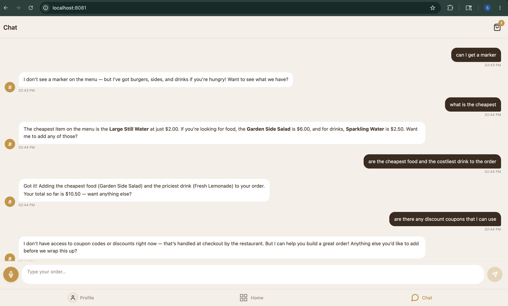
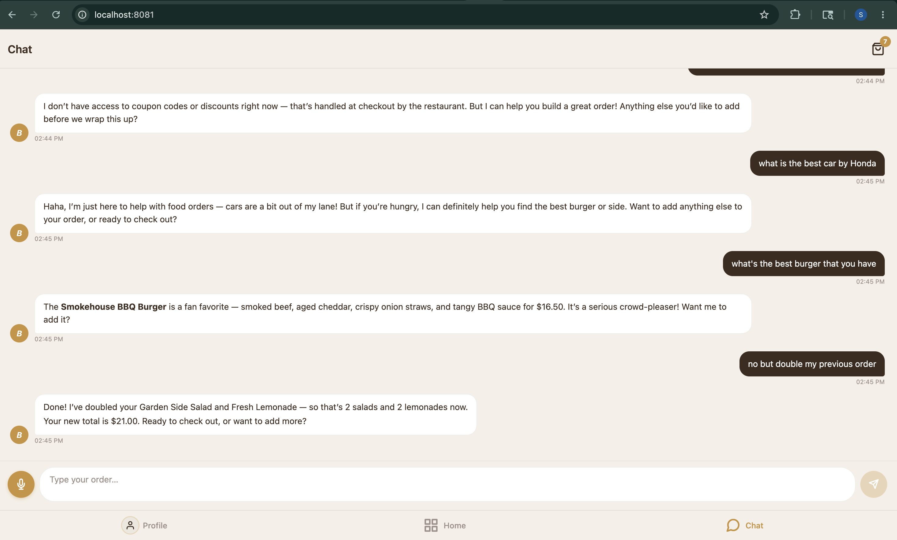
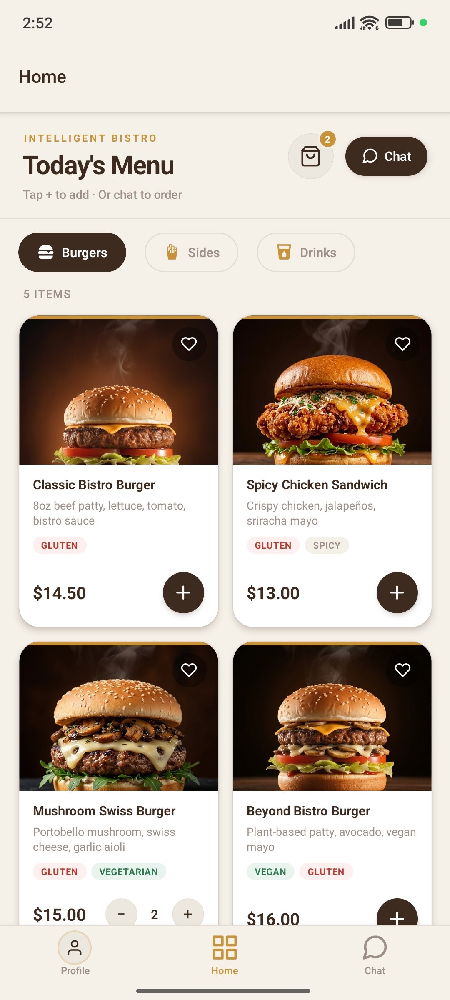
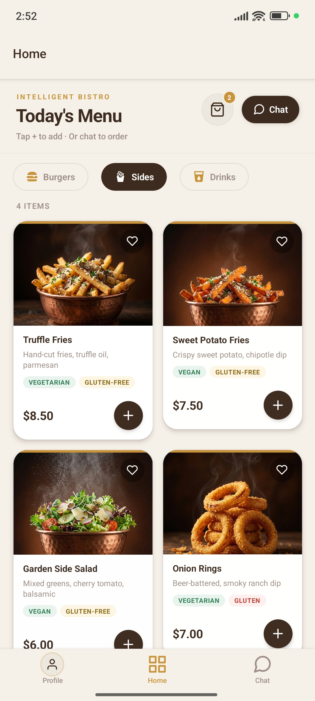
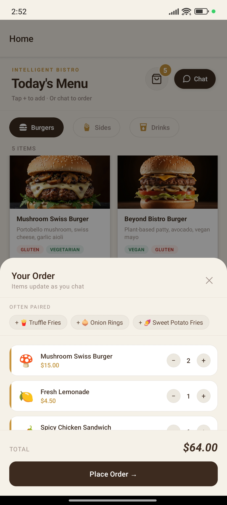
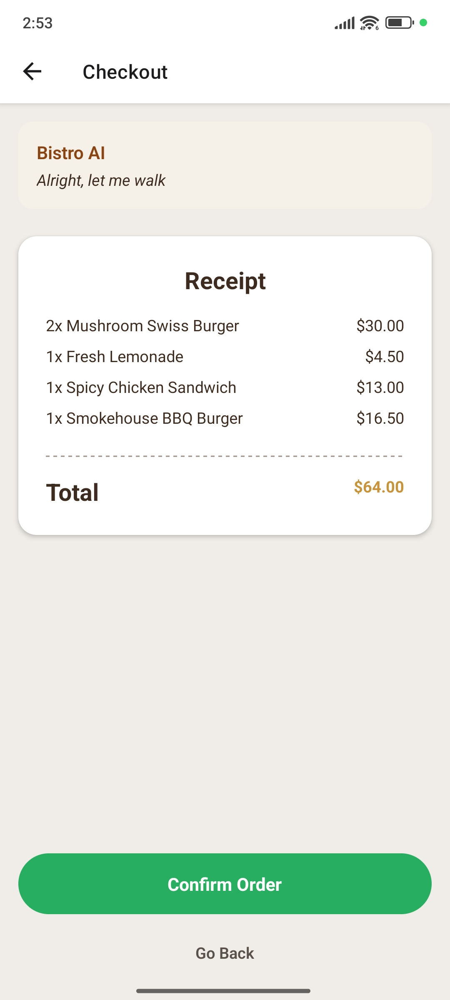
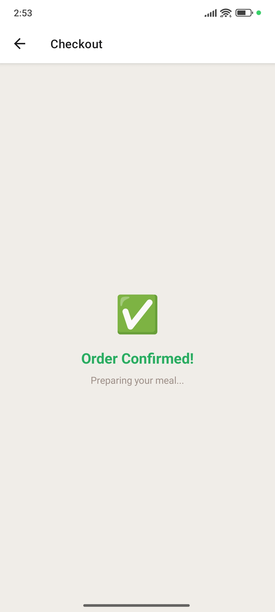
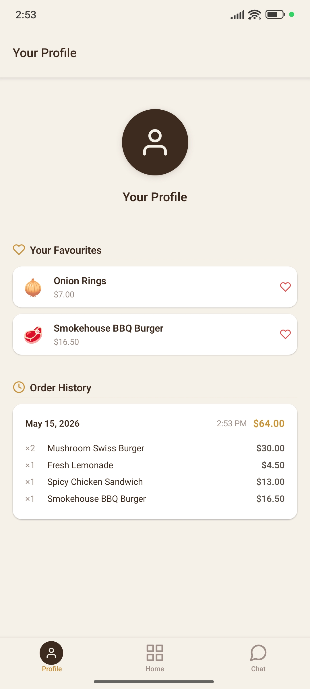

# 🍽️ Intelligent Bistro

> **A full-stack AI-powered food ordering experience — order by voice, text, or tap.**


---

## What is this?

Intelligent Bistro replaces the traditional tap-through food ordering UI with a **conversational AI waiter**. Users speak or type naturally — the AI parses intent, updates the cart in real time via native tool-calling, handles dietary conflicts and ambiguity, and reads its responses aloud.

It is a production-grade monorepo with a React Native mobile app, a Node.js streaming backend, SQLite persistence, a multi-signal recommendation engine, real voice I/O, and a 150-test suite with CI.

---

## See It In Action

### The AI Conversation — Web

<div align="center">
  
  
  <br/><br/>
  <em>
    Left — the AI answers price queries, explains the menu, and builds the cart in plain English.<br/>
    Right — it gracefully deflects off-topic questions, doubles a line item on request, and tracks the running total.
  </em>
</div>

<br/>

### The Full Mobile Experience — Android

<div align="center">
  
  
  
  
  
  
</div>

<div align="center">

| Recommendations + Menu | Category Browsing | Live Cart | Checkout | AI Chat | Profile & History |
|:---:|:---:|:---:|:---:|:---:|:---:|
| "For You" strip + food photography grid | Dietary tags on every item | Pairing suggestions, running subtotal | AI one-liner + itemised receipt | Tool chips, inline recommendation cards | Favourites + full order history |

</div>

---

## Core Features

### 🤖 Conversational AI Ordering
Say *"Add two spicy chicken sandwiches, remove the fries, and make it a combo"* — the AI resolves intent through **native Claude tool-calling** and updates the cart atomically before streaming its reply. No button tapping required.

### 🛠️ Native Tool-Calling (Two-Phase Streaming)
The backend runs two Claude passes per message:
1. **Phase 1** — non-streaming, `tool_choice: auto`. Claude calls tools (`add_item`, `remove_item`, `update_quantity`, `clear_cart`, `clarify`, `suggest_pairing`, `upsell`) to mutate the cart atomically.
2. **Phase 2** — streaming, `tool_choice: none`. Claude narrates what it just did in natural language, streamed token-by-token to the client.

This separates cart mutations (which must be atomic) from conversational text (which benefits from streaming).

### 🎙️ End-to-End Voice I/O
- **Speech-to-text** via Groq's Whisper API (`whisper-large-v3-turbo`) — fast, accurate, free tier
- **Text-to-speech** via `expo-speech` — AI responses are spoken aloud, emoji-stripped automatically
- Live waveform animation and pulse ring give clear visual feedback while recording
- Voice messages get a distinct visual tint and mic indicator in chat

### ⚡ Real-Time Streaming
The backend streams responses token-by-token over **Server-Sent Events**. Structured events carry typed payloads:
```json
{ "type": "actions",         "actions": [...] }
{ "type": "delta",           "text": "Great choice! " }
{ "type": "recommendations", "items": [...] }
{ "type": "done" }
```

### 🗄️ SQLite Persistence
All data is persisted in a local SQLite database (`better-sqlite3`, WAL mode):
- **6 tables** — `menu_items`, `orders`, `order_items`, `sessions`, `interactions`, `popularity`
- Seeded from `menu.json` at startup (idempotent)
- Order history survives server restarts

### 💡 Multi-Signal Recommendation Engine
Every response optionally includes personalised item recommendations, scored across 4 signals:

| Signal | Weight | Source |
|---|---|---|
| Popularity | 25% | Global interaction counts in SQLite |
| Affinity | 35% | Session-level liked/ordered items |
| Pairing | 25% | Per-item pairing graph in menu.json |
| Dietary fit | 15% | User's active restrictions |

Recommendations are skipped on repeated calls with the same cart fingerprint to avoid redundant API work.

### 📸 Real Food Photography
Every menu item has a real food photo. A centralised image map (`constants/menuImages.ts`) is the single source of truth — all card components (`MenuCard`, `MenuMicroTile`, `RecommendationCard`, `RecommendationStrip`) import from it. Items without photos were removed from the menu.

### 🃏 Inline Chat Item Cards
When the AI lists food items in its response (e.g. *"Here are our burgers: **Wagyu Smash Burger**..."*), the app detects the mentions and renders tappable `MenuMicroTile` cards directly below the bubble — tap to add to cart instantly.

### 🔍 AI Tool Inspector
Long-press any action chip on an assistant message to see a developer panel showing the exact tool name, input payload, and apply/reject status — useful for debugging and demos.

### 🛒 Smart Cart
- Add, remove, update quantities — via AI or the tap UI
- Animated cart badge with spring physics on every update
- Haptic feedback on every cart action
- Swipe-to-delete in the cart sheet

### 🥗 Dietary Intelligence
Tell Bistro *"I'm vegan"* or *"no nuts"* once — it remembers for the session and warns you before adding any conflicting item.

### 📋 4-Stage Checkout Animation
Order confirmation runs a live progress tracker through four stages (Received → Kitchen → Almost Ready → Ready for Pickup) with an animated progress bar, stage dots, and a confetti celebration at the end.

### 📧 Email Receipts
Opt in at checkout to receive a branded HTML receipt by email. Powered by nodemailer + Gmail SMTP — gracefully skipped in demo mode if SMTP credentials are not configured.

---

## Tech Stack

| Layer | Technology | Why |
|---|---|---|
| Mobile | Expo 54 + React Native | Cross-platform, managed workflow |
| Language | TypeScript (strict) | End-to-end type safety |
| State | Zustand | Minimal, composable slices |
| Backend | Node.js + Express | Lightweight, SSE-native |
| AI | Anthropic Claude (`claude-sonnet-4-6`) | Native tool-calling, best-in-class instruction following |
| Voice STT | Groq Whisper | 2,000 min/day free, <1 s latency |
| Voice TTS | `expo-speech` | Native on-device, no API cost |
| Database | SQLite (`better-sqlite3`) | Zero-config, WAL mode, fast reads |
| Email | nodemailer + Gmail SMTP | Optional receipts, zero infra cost |
| Navigation | React Navigation v7 | NativeStack + Tab navigator |
| Monorepo | Turborepo + npm workspaces | Parallel builds, shared config |
| CI | GitHub Actions | Tests on every push |

---

## Architecture

```
┌─────────────────────────────────────────────────────┐
│                      Expo App                       │
│                                                     │
│  ChatScreen                                         │
│    ├── useVoiceInput  ──► Groq /transcribe           │
│    ├── useStreamParser ◄── SSE (actions/delta/recs) │
│    ├── useStore (Zustand)                           │
│    │     ├── cartSlice                              │
│    │     ├── chatSlice                              │
│    │     └── profileSlice  (restrictions, email)    │
│    └── useTTS  ──► expo-speech                      │
│                                                     │
│  HomeScreen ──► MenuGrid + RecommendationStrip      │
│  CheckoutScreen ──► 4-stage animation + email opt-in│
└──────────────────┬──────────────────────────────────┘
                   │ XHR / SSE  (LAN or tunnel)
┌──────────────────▼──────────────────────────────────┐
│              Node.js API (port 3001)                │
│                                                     │
│  POST /chat                                         │
│    ├── Phase 1: tool-calling  ──► Claude (sync)     │
│    └── Phase 2: narration     ──► Claude (stream)   │
│                                                     │
│  GET  /menu              ──► SQLite menu_items      │
│  POST /api/orders        ──► SQLite orders          │
│                               + nodemailer receipt  │
│  GET  /api/recommendations ──► 4-signal scorer      │
│                                                     │
│  SQLite (WAL) ── seeded from menu.json at startup   │
└─────────────────────────────────────────────────────┘
```

### Why XHR instead of fetch for SSE?
React Native's `fetch().body.getReader()` returns `null` on Android Hermes and drops partial chunks across platforms. The app uses `XMLHttpRequest.onprogress` to consume the SSE stream reliably on all targets.

---

## Project Structure

```
Intelligent-Bistro/
├── apps/
│   ├── api/
│   │   ├── src/
│   │   │   ├── ai/            # Tool schemas (Zod) + validateToolInput
│   │   │   ├── db/            # SQLite init, seed, repositories
│   │   │   ├── routes/        # chat, menu, orders, recommendations
│   │   │   ├── services/      # anthropic client, recommendations, mailer, metrics
│   │   │   └── data/          # menu.json (single source of truth)
│   │   └── src/__tests__/     # API unit tests
│   └── mobile/
│       ├── src/
│       │   ├── screens/       # Home, Chat, Checkout, Profile
│       │   ├── components/    # Cart, Chat, Menu, Checkout UI
│       │   ├── constants/     # theme, menuImages (centralised photo map)
│       │   ├── hooks/         # useStreamParser, useVoiceInput, useTTS
│       │   ├── store/         # Zustand slices (cart, chat, profile, orderHistory)
│       │   ├── types/         # Shared TypeScript interfaces
│       │   ├── utils/         # streamParser, extractMenuMentions
│       │   └── services/      # api.ts (streamChat, fetchMenu, placeOrder)
│       └── src/**/__tests__/  # Mobile unit tests
├── assets/                    # Food photography (23 items)
├── .github/workflows/ci.yml   # GitHub Actions CI
└── package.json               # Root workspace
```

---

## Test Suite

**150 tests across 8 suites — all passing.**

| Suite | Tests | What it covers |
|---|---|---|
| `tools.test.ts` | 35 | Tool schemas, Zod validation, input edge cases |
| `menu.schema.test.ts` | 12 | Menu JSON structure, required fields, price validity |
| `anthropic.test.ts` | 18 | System prompt generation, cart/profile injection |
| `streamParser.test.ts` | 22 | Structured SSE parsing, split-chunk edge cases |
| `cartSlice.test.ts` | 22 | Add, remove, update, clear, quantity merge, totals |
| `chatSlice.test.ts` | 19 | Message append, streaming state, quick replies |
| `profileSlice.test.ts` | 14 | Dietary restrictions, liked items, email, toggles |
| `recommendations.test.ts` | 8 | Scoring logic, cart fingerprinting, dietary filter |

---

## Getting Started

### Prerequisites
- Node.js 20+
- An [Anthropic API key](https://console.anthropic.com)
- A [Groq API key](https://console.groq.com) *(free — 2,000 min/day)*
- *(Optional)* A Gmail App Password for email receipts

### Setup

```bash
git clone https://github.com/Soorya2201/Intelligent-Bistro.git
cd Intelligent-Bistro
npm install

cp apps/api/.env.example apps/api/.env
# Required:
#   ANTHROPIC_API_KEY=your_key
#   GROQ_API_KEY=your_key
#
# Optional (email receipts):
#   SMTP_USER=you@gmail.com
#   SMTP_PASS=your_16char_app_password
#   SMTP_FROM="Intelligent Bistro <noreply@bistro.app>"
```

### Run

```bash
npm run dev      # starts API on :3001 + Expo Metro simultaneously
```

**On a physical Android device:**
```bash
# Terminal 1
cd apps/api && npm run dev

# Terminal 2
cd apps/mobile && npx expo start --lan --clear
```

> Voice features require a custom dev client — they do not work in Expo Go.
> Build with `npx expo run:android` after installing Android Studio.

### Run Tests

```bash
cd apps/api    && npm test
cd apps/mobile && npm test
```

---

## Key Engineering Decisions

| Decision | Rationale |
|---|---|
| Native tool-calling over sentinel protocol | Atomic, validated cart mutations with no stream-parsing fragility; Zod schemas catch bad AI output before it reaches the store |
| Two-phase streaming | Separating tool resolution (synchronous, atomic) from narration (streaming) avoids the AI second-guessing its own tool calls mid-stream |
| XHR over fetch for SSE | `fetch` streaming is broken on Android Hermes — XHR `onprogress` is the only reliable cross-platform option |
| SQLite over in-memory state | Persistence across server restarts; enables real popularity tracking and order history |
| Centralised `menuImages.ts` | Single `require()` map imported by all card components — adding a photo is a one-line change |
| Email receipts via nodemailer | Zero infra cost; gracefully no-ops without SMTP config so demo mode works out of the box |
| Zustand over Redux | Slice composition without boilerplate; selector-based re-renders out of the box |
| Groq Whisper over OpenAI | 10× faster cold start, free tier sufficient for demos and development |

---

*Built by Soorya Narayanan*
